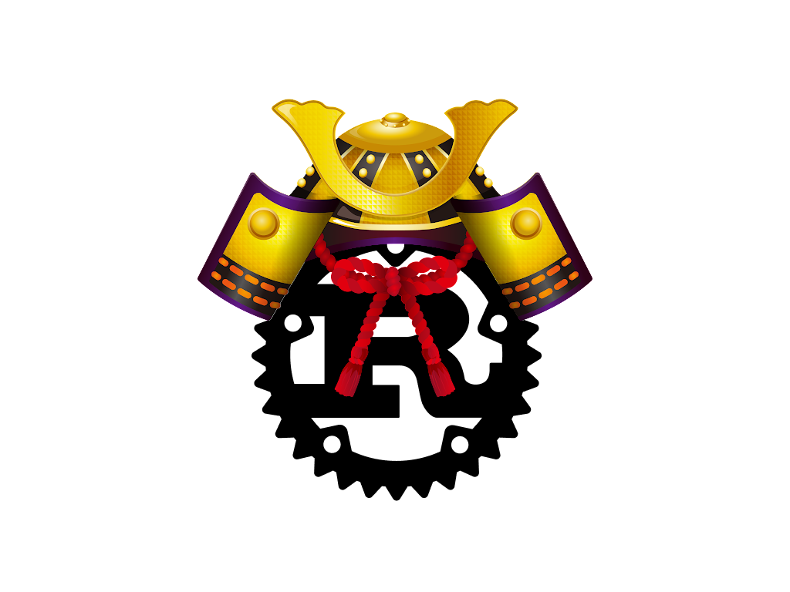

# sabi



In Japanese version https://github.com/bnjbvr/rouille. Shamelessly copied and updated from it.

Aren't you 疲れた from writing Rust programs in English? Do you like saying "くだらない" a lot? Would you like to try something different, in an exotic and funny-sounding language? Would you want to bring some Japanese touch to your programs?

sabi (Japanese for Rust; 錆) is here to save your day, as it allows you to write Rust programs in Japanese, using Japanese keywords, Japanese function names, Japanese idioms.

You don't feel at ease using only Japanese words? Don't worry! Japanese Rust is fully compatible with English-Rust, so you can mix both at your convenience.

Here's an example of what can be achieved with sabi:

日本語で Rust プログラムを書くことができます！

# 例

`main.rs`

```rust
sabi::sabi! {
    外部 箱 sabi;

    関数 メイン() {
        書き出す!("こんにちは、世界");
    }
}
```

出力結果。

```
❯ cargo run
こんにちは、世界
```

# Thank you

https://github.com/bnjbvr/rouille

# License

[WTFPL](http://www.wtfpl.net/)
